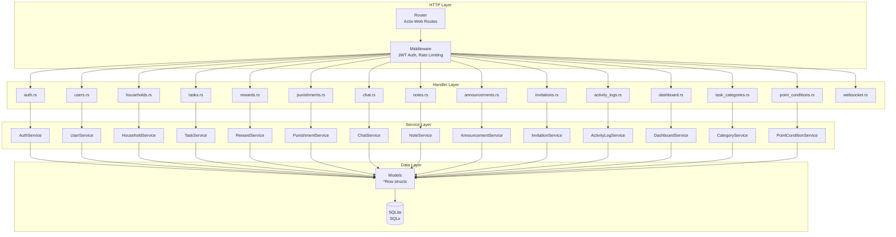
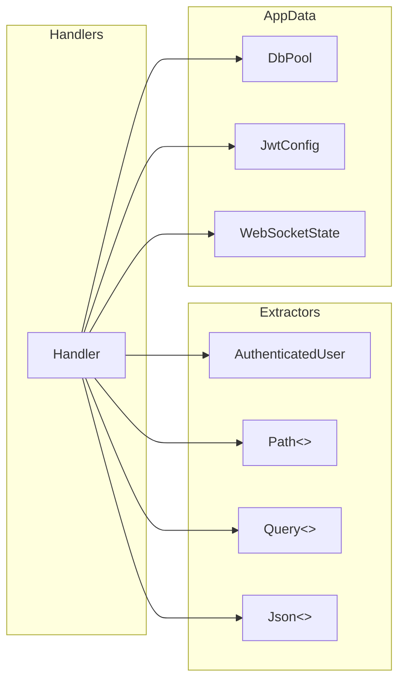
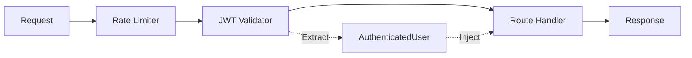
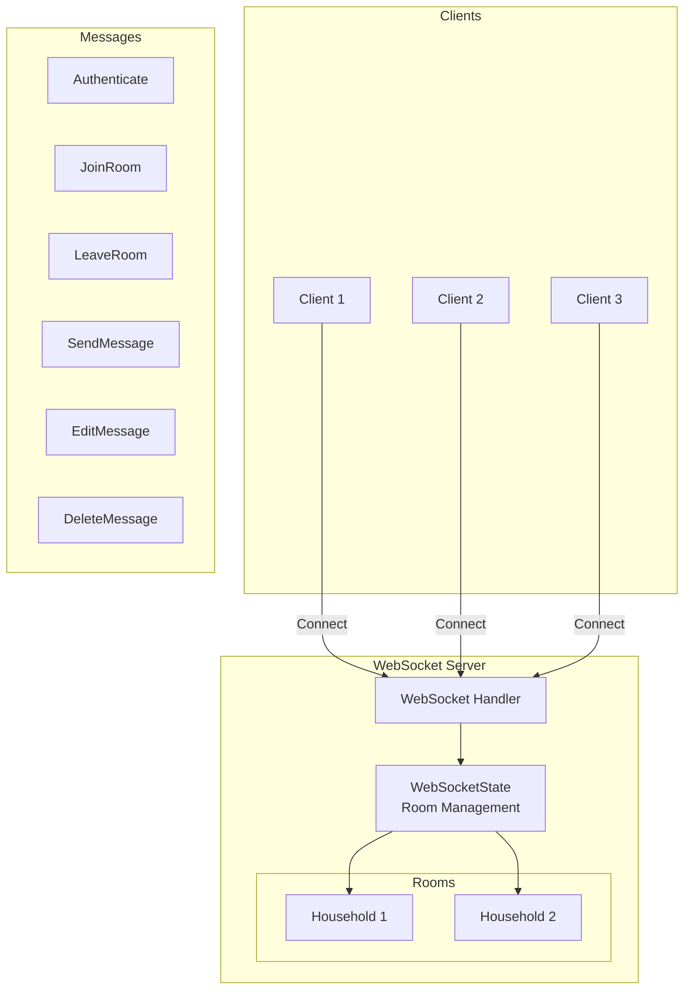
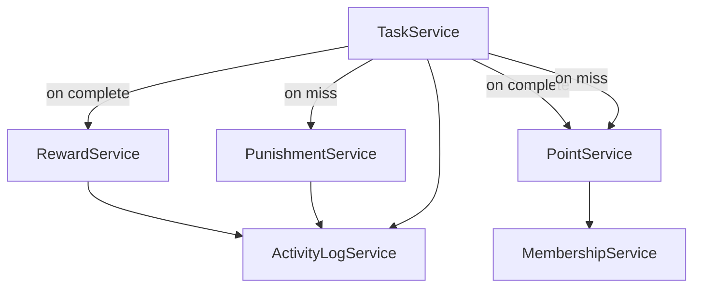

# Backend Architecture

## Layered Architecture

```mermaid
flowchart TB
    subgraph "HTTP Layer"
        MW[Middleware<br/>JWT Auth, Rate Limiting]
        RT[Router<br/>Actix-Web Routes]
    end

    subgraph "Handler Layer"
        Auth[auth.rs]
        Users[users.rs]
        HH[households.rs]
        Tasks[tasks.rs]
        Rewards[rewards.rs]
        Punishments[punishments.rs]
        Chat[chat.rs]
        Notes[notes.rs]
        Ann[announcements.rs]
        Inv[invitations.rs]
        Act[activity_logs.rs]
        Dash[dashboard.rs]
        Cat[task_categories.rs]
        PC[point_conditions.rs]
        WS[websocket.rs]
    end

    subgraph "Service Layer"
        AuthSvc[AuthService]
        UserSvc[UserService]
        HHSvc[HouseholdService]
        TaskSvc[TaskService]
        RewardSvc[RewardService]
        PunishSvc[PunishmentService]
        ChatSvc[ChatService]
        NoteSvc[NoteService]
        AnnSvc[AnnouncementService]
        InvSvc[InvitationService]
        ActSvc[ActivityLogService]
        DashSvc[DashboardService]
        CatSvc[CategoryService]
        PCSvc[PointConditionService]
    end

    subgraph "Data Layer"
        Models[Models<br/>*Row structs]
        DB[(SQLite<br/>SQLx)]
    end

    RT --> MW
    MW --> Auth & Users & HH & Tasks & Rewards & Punishments & Chat & Notes & Ann & Inv & Act & Dash & Cat & PC & WS

    Auth --> AuthSvc
    Users --> UserSvc
    HH --> HHSvc
    Tasks --> TaskSvc
    Rewards --> RewardSvc
    Punishments --> PunishSvc
    Chat --> ChatSvc
    Notes --> NoteSvc
    Ann --> AnnSvc
    Inv --> InvSvc
    Act --> ActSvc
    Dash --> DashSvc
    Cat --> CatSvc
    PC --> PCSvc

    AuthSvc & UserSvc & HHSvc & TaskSvc & RewardSvc & PunishSvc & ChatSvc & NoteSvc & AnnSvc & InvSvc & ActSvc & DashSvc & CatSvc & PCSvc --> Models
    Models --> DB
```

## Handler Dependencies

```mermaid
flowchart LR
    subgraph Handlers
        direction TB
        H[Handler]
    end

    subgraph Extractors
        AU[AuthenticatedUser]
        Path[Path<>]
        Query[Query<>]
        Json[Json<>]
    end

    subgraph AppData
        Pool[DbPool]
        JWT[JwtConfig]
        WS[WebSocketState]
    end

    H --> AU & Path & Query & Json
    H --> Pool & JWT & WS
```

## Middleware Pipeline

```mermaid
flowchart LR
    Req[Request] --> RL[Rate Limiter]
    RL --> JWT[JWT Validator]
    JWT --> Handler[Route Handler]
    Handler --> Resp[Response]

    JWT -.->|Extract| User[AuthenticatedUser]
    User -.->|Inject| Handler
```

## WebSocket Architecture

```mermaid
flowchart TB
    subgraph Clients
        C1[Client 1]
        C2[Client 2]
        C3[Client 3]
    end

    subgraph "WebSocket Server"
        WS[WebSocket Handler]
        State[WebSocketState<br/>Room Management]

        subgraph Rooms
            R1[Household 1]
            R2[Household 2]
        end
    end

    C1 & C2 -->|Connect| WS
    C3 -->|Connect| WS
    WS --> State
    State --> R1 & R2

    subgraph Messages
        Auth[Authenticate]
        Join[JoinRoom]
        Leave[LeaveRoom]
        Send[SendMessage]
        Edit[EditMessage]
        Del[DeleteMessage]
    end
```

## Service Interactions

```mermaid
flowchart TB
    TaskSvc[TaskService]
    RewardSvc[RewardService]
    PunishSvc[PunishmentService]
    PointSvc[PointService]
    ActSvc[ActivityLogService]
    MemberSvc[MembershipService]

    TaskSvc -->|on complete| RewardSvc
    TaskSvc -->|on complete| PointSvc
    TaskSvc -->|on miss| PunishSvc
    TaskSvc -->|on miss| PointSvc

    RewardSvc --> ActSvc
    PunishSvc --> ActSvc
    PointSvc --> MemberSvc
    TaskSvc --> ActSvc
```
