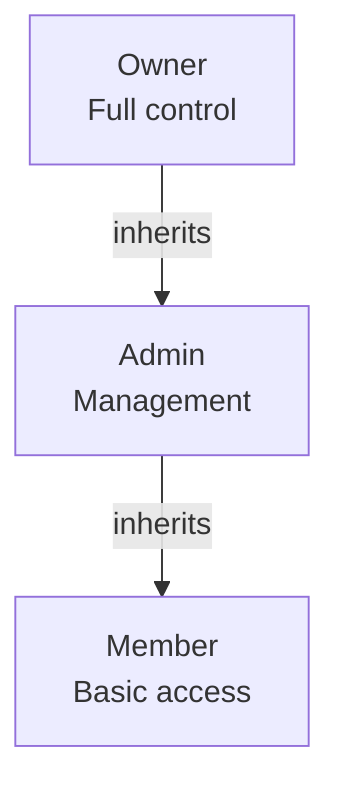
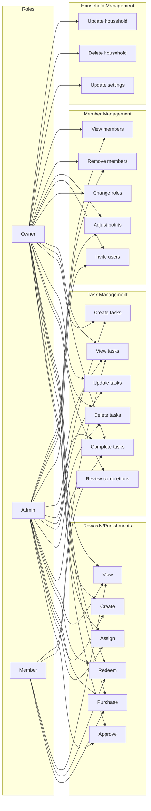
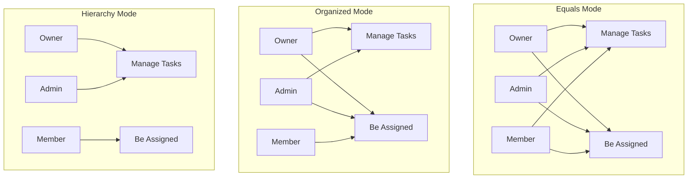
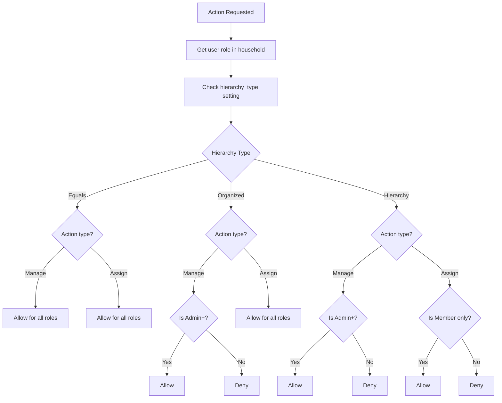
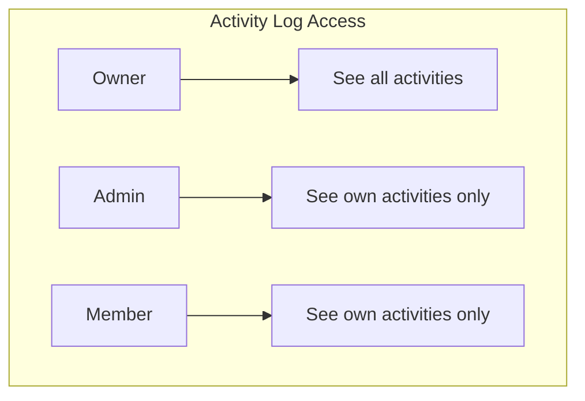
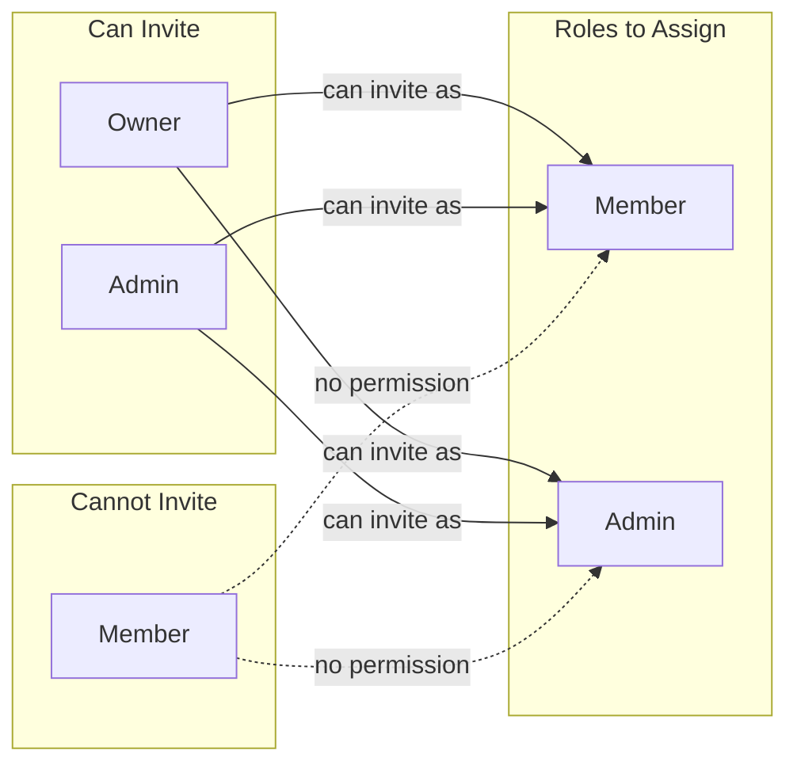
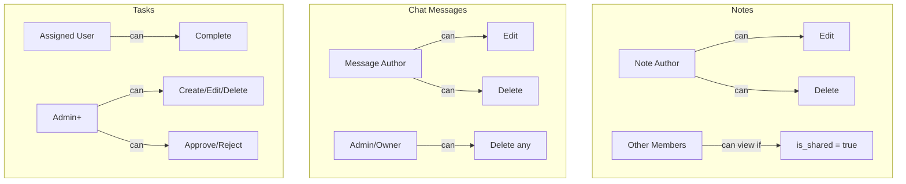
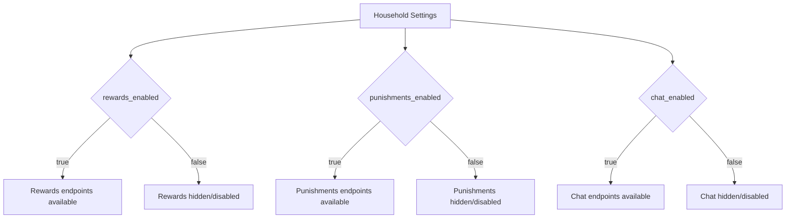

# Roles and Permissions

## Role Hierarchy

## Permission Matrix

## Hierarchy Types

## Permission Check Flow

## Activity Visibility

## Invitation Permissions

## Resource Ownership Rules

## Feature Flags Impact

