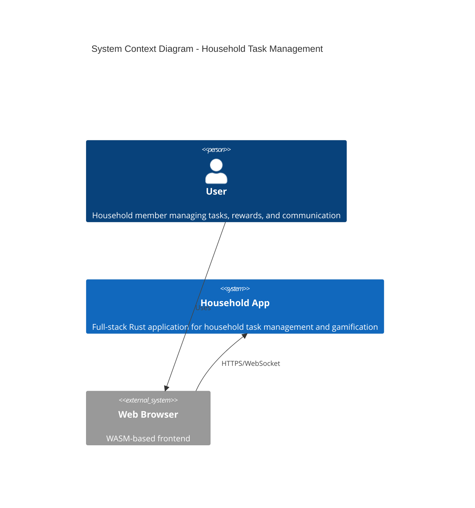
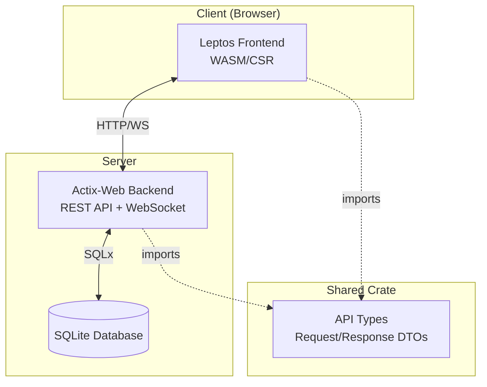
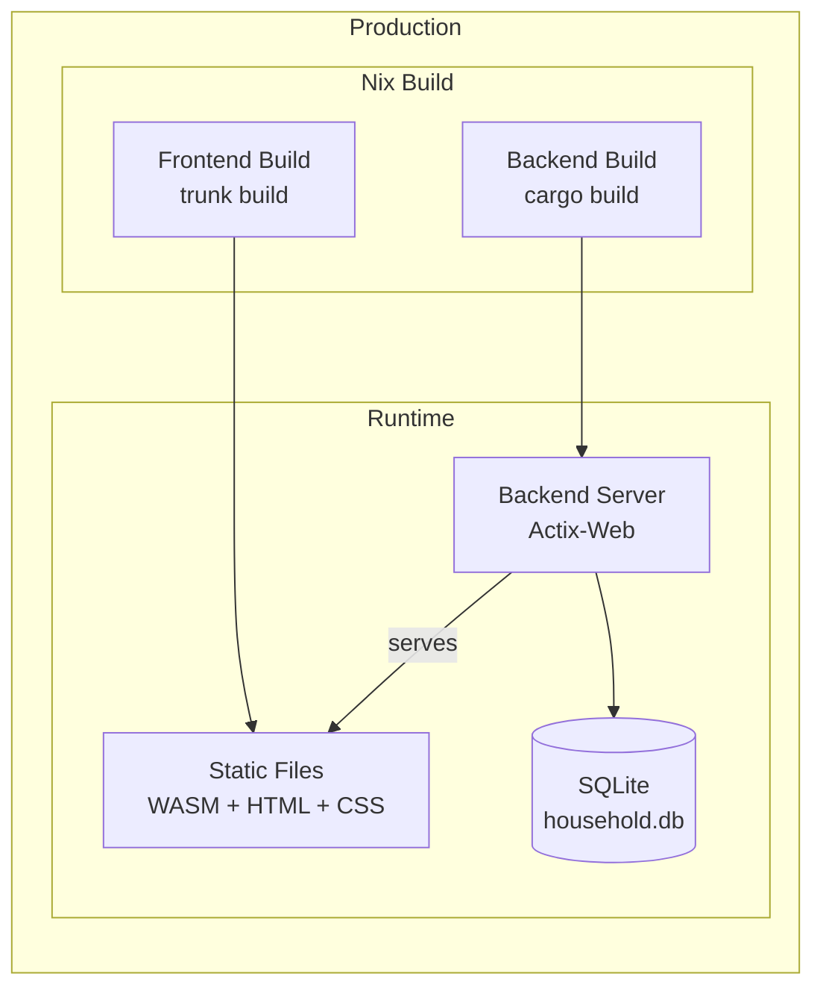
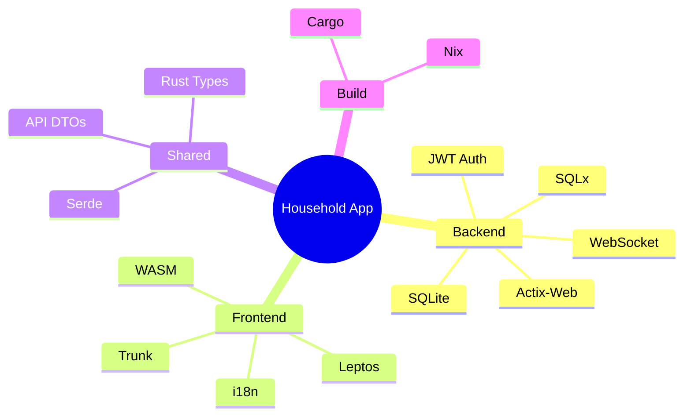

# System Overview

## Context Diagram

```mermaid
C4Context
    title System Context Diagram - Household Task Management

    Person(user, "User", "Household member managing tasks, rewards, and communication")

    System(app, "Household App", "Full-stack Rust application for household task management and gamification")

    System_Ext(browser, "Web Browser", "WASM-based frontend")

    Rel(user, browser, "Uses")
    Rel(browser, app, "HTTPS/WebSocket")
```

## High-Level Architecture

```mermaid
flowchart TB
    subgraph Client["Client (Browser)"]
        FE[Leptos Frontend<br/>WASM/CSR]
    end

    subgraph Server["Server"]
        BE[Actix-Web Backend<br/>REST API + WebSocket]
        DB[(SQLite Database)]
    end

    subgraph Shared["Shared Crate"]
        Types[API Types<br/>Request/Response DTOs]
    end

    FE <-->|HTTP/WS| BE
    BE <-->|SQLx| DB
    FE -.->|imports| Types
    BE -.->|imports| Types
```

## Deployment Architecture

```mermaid
flowchart LR
    subgraph Production
        subgraph "Nix Build"
            FB[Frontend Build<br/>trunk build]
            BB[Backend Build<br/>cargo build]
        end

        subgraph "Runtime"
            Static[Static Files<br/>WASM + HTML + CSS]
            Server[Backend Server<br/>Actix-Web]
            SQLite[(SQLite<br/>household.db)]
        end
    end

    FB --> Static
    BB --> Server
    Server --> SQLite
    Server -->|serves| Static
```

## Technology Stack

```mermaid
mindmap
    root((Household App))
        Backend
            Actix-Web
            SQLx
            SQLite
            JWT Auth
            WebSocket
        Frontend
            Leptos
            WASM
            Trunk
            i18n
        Shared
            Rust Types
            Serde
            API DTOs
        Build
            Nix
            Cargo
```
