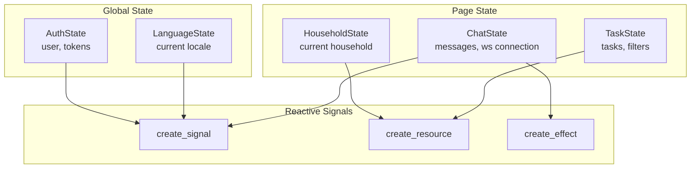
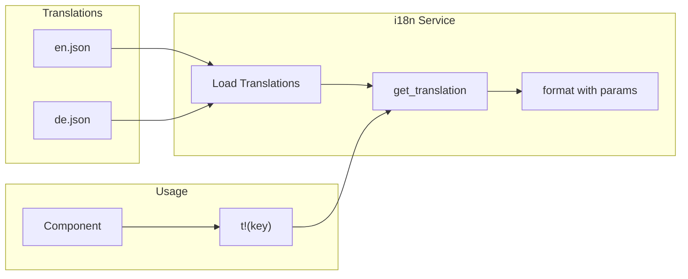
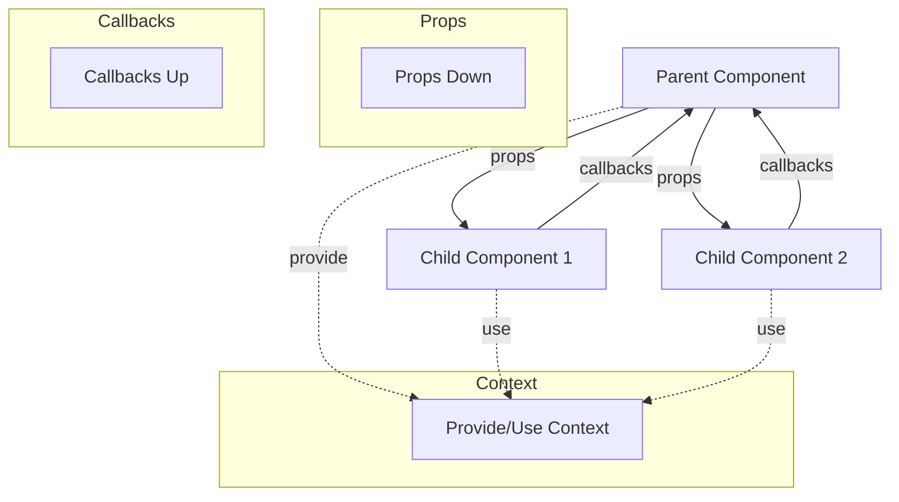

# Frontend Architecture

## Component Structure

```mermaid
flowchart TB
    subgraph App["Leptos App (WASM)"]
        Router[Router]

        subgraph Pages
            Login[LoginPage]
            Register[RegisterPage]
            Dashboard[DashboardPage]
            Household[HouseholdPage]
            HHSettings[HouseholdSettingsPage]
            Tasks[TasksPage]
            Rewards[RewardsPage]
            Punishments[PunishmentsPage]
            Chat[ChatPage]
            Notes[NotesPage]
            Activity[ActivityPage]
            Settings[SettingsPage]
            UserSettings[UserSettingsPage]
        end

        subgraph Components
            Header[Header]
            Nav[Navigation]
            TaskList[TaskList]
            TaskForm[TaskForm]
            TaskDetailModal[TaskDetailModal]
            RewardCard[RewardCard]
            MemberList[MemberList]
            Leaderboard[Leaderboard]
            ChatWindow[ChatWindow]
            NoteEditor[NoteEditor]
        end

        subgraph Services
            API[ApiClient]
            Auth[AuthService]
            WS[WebSocketClient]
            i18n[i18n Service]
        end
    end

    Router --> Pages
    Pages --> Components
    Pages --> Services
    Components --> Services
```



## Page Routing

```mermaid
flowchart LR
    subgraph "Public Routes"
        L[/login]
        R[/register]
    end

    subgraph "Protected Routes"
        D[/dashboard]
        H[/households/:id]
        HS[/households/:id/settings]
        T[/households/:id/tasks]
        RW[/households/:id/rewards]
        P[/households/:id/punishments]
        C[/households/:id/chat]
        N[/households/:id/notes]
        A[/households/:id/activity]
        S[/settings]
        US[/settings/user]
    end

    Guard{Auth Guard}
    L & R --> Guard
    Guard -->|authenticated| D
    Guard -->|not authenticated| L
    D --> H --> HS & T & RW & P & C & N & A
    D --> S --> US
```

## State Management



## API Client Architecture

```mermaid
flowchart TB
    subgraph ApiClient
        Base[Base HTTP Client]

        subgraph Modules
            AuthApi[auth()]
            UserApi[users()]
            HHApi[households()]
            TaskApi[tasks()]
            RewardApi[rewards()]
            PunishApi[punishments()]
            ChatApi[chat()]
            NoteApi[notes()]
            AnnApi[announcements()]
            InvApi[invitations()]
            ActApi[activities()]
            DashApi[dashboard()]
        end
    end

    subgraph "Request Flow"
        Req[Request] --> Token[Add Auth Token]
        Token --> Send[Send Request]
        Send --> Resp{Response}
        Resp -->|401| Refresh[Refresh Token]
        Refresh --> Retry[Retry Request]
        Resp -->|Success| Parse[Parse JSON]
    end

    Base --> Modules
    Modules --> Req
```

## i18n System



## Component Communication


