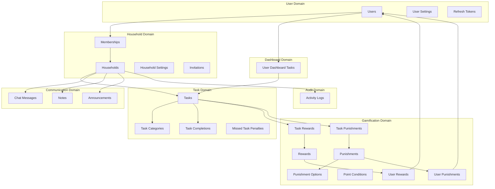
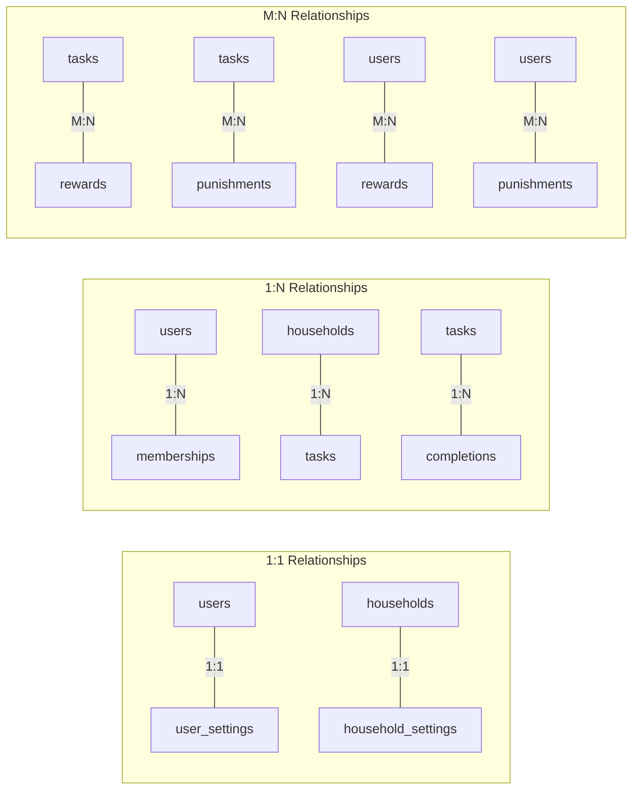

# Database Schema

## Entity Relationship Diagram

```mermaid
erDiagram
    users ||--o{ households : owns
    users ||--o{ household_memberships : has
    users ||--o{ task_completions : completes
    users ||--o{ user_rewards : earns
    users ||--o{ user_punishments : receives
    users ||--o{ chat_messages : sends
    users ||--o{ notes : creates
    users ||--o{ journal_entries : writes
    users ||--o{ announcements : creates
    users ||--o{ activity_logs : performs
    users ||--o{ refresh_tokens : has
    users ||--|| user_settings : has
    users ||--o{ user_dashboard_tasks : configures
    users ||--o{ household_invitations : sends

    households ||--o{ household_memberships : contains
    households ||--o{ tasks : has
    households ||--o{ task_categories : has
    households ||--o{ rewards : has
    households ||--o{ punishments : has
    households ||--o{ point_conditions : has
    households ||--o{ household_invitations : has
    households ||--o{ chat_messages : contains
    households ||--o{ notes : contains
    households ||--o{ journal_entries : contains
    households ||--o{ announcements : contains
    households ||--o{ activity_logs : logs
    households ||--|| household_settings : has

    tasks ||--o{ task_completions : has
    tasks ||--o{ task_rewards : links
    tasks ||--o{ task_punishments : links
    tasks ||--o{ missed_task_penalties : tracks
    tasks }o--|| task_categories : belongs_to

    rewards ||--o{ task_rewards : linked_to
    rewards ||--o{ user_rewards : assigned_to
    rewards ||--o{ reward_options : has_options
    reward_options }o--|| rewards : option_is

    punishments ||--o{ task_punishments : linked_to
    punishments ||--o{ user_punishments : assigned_to
    punishments ||--o{ punishment_options : has_options
    punishment_options }o--|| punishments : option_is

    users {
        TEXT id PK
        TEXT username UK
        TEXT email UK
        TEXT password_hash
        TEXT oidc_subject
        TEXT oidc_provider
        DATETIME created_at
        DATETIME updated_at
    }

    households {
        TEXT id PK
        TEXT name
        TEXT owner_id FK
        DATETIME created_at
        DATETIME updated_at
    }

    household_memberships {
        TEXT id PK
        TEXT household_id FK
        TEXT user_id FK
        TEXT role
        INTEGER points
        DATETIME joined_at
    }

    tasks {
        TEXT id PK
        TEXT household_id FK
        TEXT title
        TEXT description
        TEXT recurrence_type
        TEXT recurrence_value
        TEXT assigned_user_id FK
        INTEGER target_count
        TEXT time_period
        BOOLEAN allow_exceed_target
        BOOLEAN requires_review
        INTEGER points_reward
        INTEGER points_penalty
        TEXT due_time
        TEXT habit_type
        TEXT category_id FK
        DATETIME created_at
        DATETIME updated_at
    }

    task_categories {
        TEXT id PK
        TEXT household_id FK
        TEXT name
        TEXT color
        INTEGER sort_order
        DATETIME created_at
    }

    task_completions {
        TEXT id PK
        TEXT task_id FK
        TEXT user_id FK
        DATETIME completed_at
        DATE due_date
        TEXT status
    }

    rewards {
        TEXT id PK
        TEXT household_id FK
        TEXT name
        TEXT description
        INTEGER point_cost
        BOOLEAN is_purchasable
        BOOLEAN requires_confirmation
        TEXT reward_type
        DATETIME created_at
    }

    reward_options {
        TEXT id PK
        TEXT parent_reward_id FK
        TEXT option_reward_id FK
        DATETIME created_at
    }

    task_rewards {
        TEXT task_id PK_FK
        TEXT reward_id PK_FK
        INTEGER amount
    }

    user_rewards {
        TEXT id PK
        TEXT user_id FK
        TEXT reward_id FK
        TEXT household_id FK
        INTEGER amount
        INTEGER redeemed_amount
        INTEGER pending_redemption
        DATETIME updated_at
    }

    punishments {
        TEXT id PK
        TEXT household_id FK
        TEXT name
        TEXT description
        BOOLEAN requires_confirmation
        TEXT punishment_type
        DATETIME created_at
    }

    punishment_options {
        TEXT id PK
        TEXT parent_punishment_id FK
        TEXT option_punishment_id FK
        DATETIME created_at
    }

    task_punishments {
        TEXT task_id PK_FK
        TEXT punishment_id PK_FK
        INTEGER amount
    }

    user_punishments {
        TEXT id PK
        TEXT user_id FK
        TEXT punishment_id FK
        TEXT household_id FK
        INTEGER amount
        INTEGER completed_amount
        INTEGER pending_completion
        DATETIME updated_at
    }

    point_conditions {
        TEXT id PK
        TEXT household_id FK
        TEXT name
        TEXT condition_type
        INTEGER points_value
        INTEGER streak_threshold
        REAL multiplier
        TEXT task_id FK
        DATETIME created_at
    }

    household_invitations {
        TEXT id PK
        TEXT household_id FK
        TEXT email
        TEXT role
        TEXT invited_by FK
        TEXT status
        DATETIME created_at
        DATETIME expires_at
        DATETIME responded_at
    }

    household_settings {
        TEXT household_id PK_FK
        BOOLEAN dark_mode
        TEXT role_label_owner
        TEXT role_label_admin
        TEXT role_label_member
        TEXT hierarchy_type
        TEXT timezone
        BOOLEAN rewards_enabled
        BOOLEAN punishments_enabled
        BOOLEAN chat_enabled
        DATETIME updated_at
    }

    user_settings {
        TEXT user_id PK_FK
        TEXT language
        DATETIME updated_at
    }

    activity_logs {
        TEXT id PK
        TEXT household_id FK
        TEXT actor_id FK
        TEXT affected_user_id FK
        TEXT activity_type
        TEXT entity_type
        TEXT entity_id
        TEXT details
        DATETIME created_at
    }

    chat_messages {
        TEXT id PK
        TEXT household_id FK
        TEXT user_id FK
        TEXT content
        DATETIME created_at
        DATETIME updated_at
        DATETIME deleted_at
    }

    notes {
        TEXT id PK
        TEXT household_id FK
        TEXT user_id FK
        TEXT title
        TEXT content
        BOOLEAN is_shared
        DATETIME created_at
        DATETIME updated_at
    }

    journal_entries {
        TEXT id PK
        TEXT household_id FK
        TEXT user_id FK
        TEXT title
        TEXT content
        DATE entry_date
        BOOLEAN is_shared
        DATETIME created_at
        DATETIME updated_at
    }

    announcements {
        TEXT id PK
        TEXT household_id FK
        TEXT created_by FK
        TEXT title
        TEXT content
        DATETIME starts_at
        DATETIME ends_at
        DATETIME created_at
        DATETIME updated_at
    }

    refresh_tokens {
        TEXT id PK
        TEXT user_id FK
        TEXT token_hash
        DATETIME expires_at
        DATETIME created_at
    }

    user_dashboard_tasks {
        TEXT user_id PK_FK
        TEXT task_id PK_FK
        TEXT created_at
    }

    missed_task_penalties {
        TEXT task_id PK_FK
        DATE due_date PK
        DATETIME processed_at
    }
```

## Core Domain Model



## Table Relationships Summary


