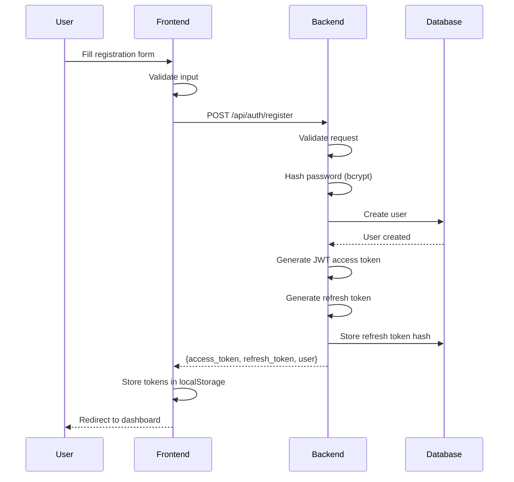
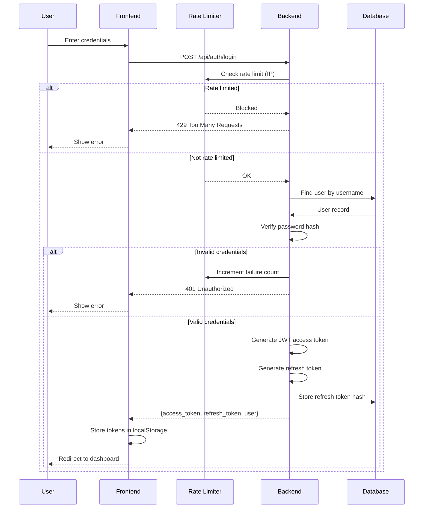
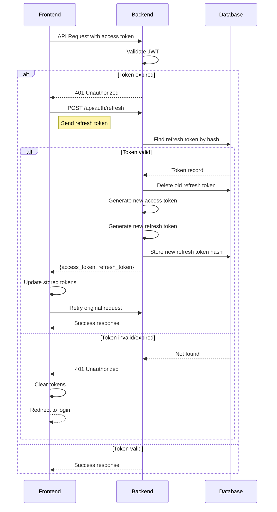
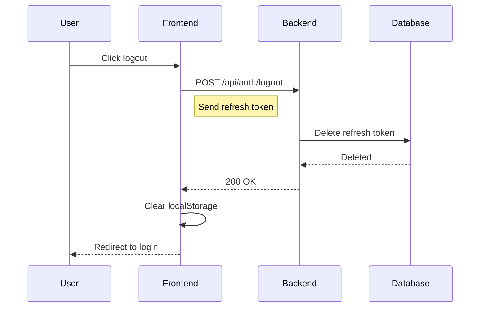
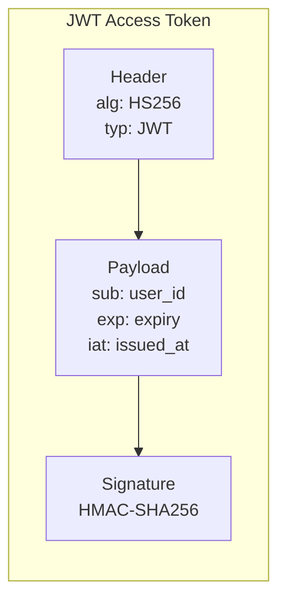
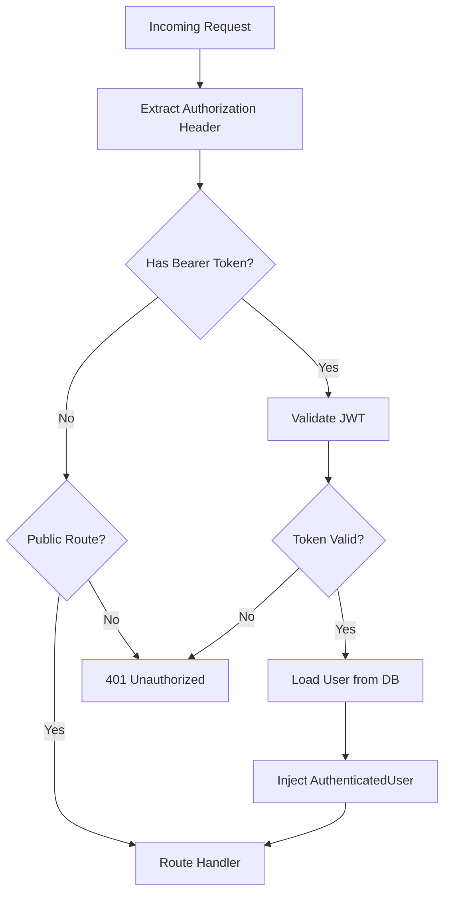
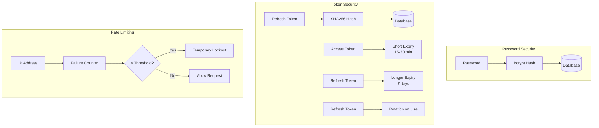

# Authentication Flow

## Registration Flow

```mermaid
sequenceDiagram
    participant U as User
    participant FE as Frontend
    participant BE as Backend
    participant DB as Database

    U->>FE: Fill registration form
    FE->>FE: Validate input
    FE->>BE: POST /api/auth/register
    BE->>BE: Validate request
    BE->>BE: Hash password (bcrypt)
    BE->>DB: Create user
    DB-->>BE: User created
    BE->>BE: Generate JWT access token
    BE->>BE: Generate refresh token
    BE->>DB: Store refresh token hash
    BE-->>FE: {access_token, refresh_token, user}
    FE->>FE: Store tokens in localStorage
    FE-->>U: Redirect to dashboard
```

## Login Flow

```mermaid
sequenceDiagram
    participant U as User
    participant FE as Frontend
    participant RL as Rate Limiter
    participant BE as Backend
    participant DB as Database

    U->>FE: Enter credentials
    FE->>BE: POST /api/auth/login
    BE->>RL: Check rate limit (IP)
    alt Rate limited
        RL-->>BE: Blocked
        BE-->>FE: 429 Too Many Requests
        FE-->>U: Show error
    else Not rate limited
        RL-->>BE: OK
        BE->>DB: Find user by username
        DB-->>BE: User record
        BE->>BE: Verify password hash
        alt Invalid credentials
            BE->>RL: Increment failure count
            BE-->>FE: 401 Unauthorized
            FE-->>U: Show error
        else Valid credentials
            BE->>BE: Generate JWT access token
            BE->>BE: Generate refresh token
            BE->>DB: Store refresh token hash
            BE-->>FE: {access_token, refresh_token, user}
            FE->>FE: Store tokens in localStorage
            FE-->>U: Redirect to dashboard
        end
    end
```

## Token Refresh Flow

```mermaid
sequenceDiagram
    participant FE as Frontend
    participant BE as Backend
    participant DB as Database

    FE->>BE: API Request with access token
    BE->>BE: Validate JWT
    alt Token expired
        BE-->>FE: 401 Unauthorized
        FE->>BE: POST /api/auth/refresh
        Note right of FE: Send refresh token
        BE->>DB: Find refresh token by hash
        alt Token valid
            DB-->>BE: Token record
            BE->>DB: Delete old refresh token
            BE->>BE: Generate new access token
            BE->>BE: Generate new refresh token
            BE->>DB: Store new refresh token hash
            BE-->>FE: {access_token, refresh_token}
            FE->>FE: Update stored tokens
            FE->>BE: Retry original request
            BE-->>FE: Success response
        else Token invalid/expired
            DB-->>BE: Not found
            BE-->>FE: 401 Unauthorized
            FE->>FE: Clear tokens
            FE-->>FE: Redirect to login
        end
    else Token valid
        BE-->>FE: Success response
    end
```

## Logout Flow

```mermaid
sequenceDiagram
    participant U as User
    participant FE as Frontend
    participant BE as Backend
    participant DB as Database

    U->>FE: Click logout
    FE->>BE: POST /api/auth/logout
    Note right of FE: Send refresh token
    BE->>DB: Delete refresh token
    DB-->>BE: Deleted
    BE-->>FE: 200 OK
    FE->>FE: Clear localStorage
    FE-->>U: Redirect to login
```

## JWT Token Structure

```mermaid
flowchart LR
    subgraph JWT["JWT Access Token"]
        Header[Header<br/>alg: HS256<br/>typ: JWT]
        Payload[Payload<br/>sub: user_id<br/>exp: expiry<br/>iat: issued_at]
        Signature[Signature<br/>HMAC-SHA256]
    end

    Header --> Payload --> Signature
```

## Authentication Middleware

```mermaid
flowchart TB
    Req[Incoming Request] --> Extract[Extract Authorization Header]
    Extract --> Check{Has Bearer Token?}
    Check -->|No| Public{Public Route?}
    Public -->|Yes| Handler[Route Handler]
    Public -->|No| Unauth[401 Unauthorized]

    Check -->|Yes| Validate[Validate JWT]
    Validate --> Valid{Token Valid?}
    Valid -->|No| Unauth
    Valid -->|Yes| LoadUser[Load User from DB]
    LoadUser --> Inject[Inject AuthenticatedUser]
    Inject --> Handler
```

## Security Measures

```mermaid
flowchart TB
    subgraph "Password Security"
        PW[Password] --> Bcrypt[Bcrypt Hash]
        Bcrypt --> DB[(Database)]
    end

    subgraph "Token Security"
        RT[Refresh Token] --> SHA256[SHA256 Hash]
        SHA256 --> DB2[(Database)]
        AT[Access Token] --> Short[Short Expiry<br/>15-30 min]
        RT2[Refresh Token] --> Long[Longer Expiry<br/>7 days]
        RT3[Refresh Token] --> Rotate[Rotation on Use]
    end

    subgraph "Rate Limiting"
        IP[IP Address] --> Counter[Failure Counter]
        Counter --> Block{> Threshold?}
        Block -->|Yes| Lockout[Temporary Lockout]
        Block -->|No| Allow[Allow Request]
    end
```
