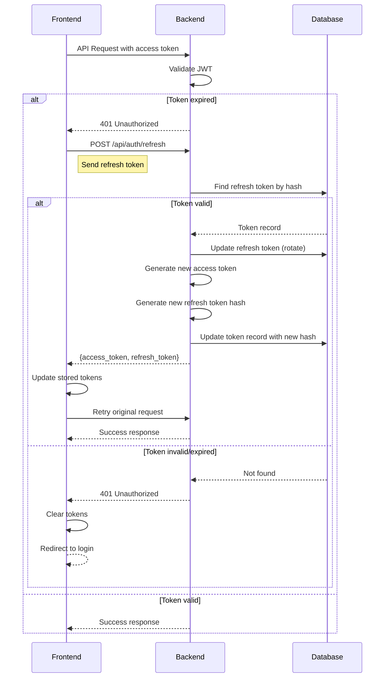
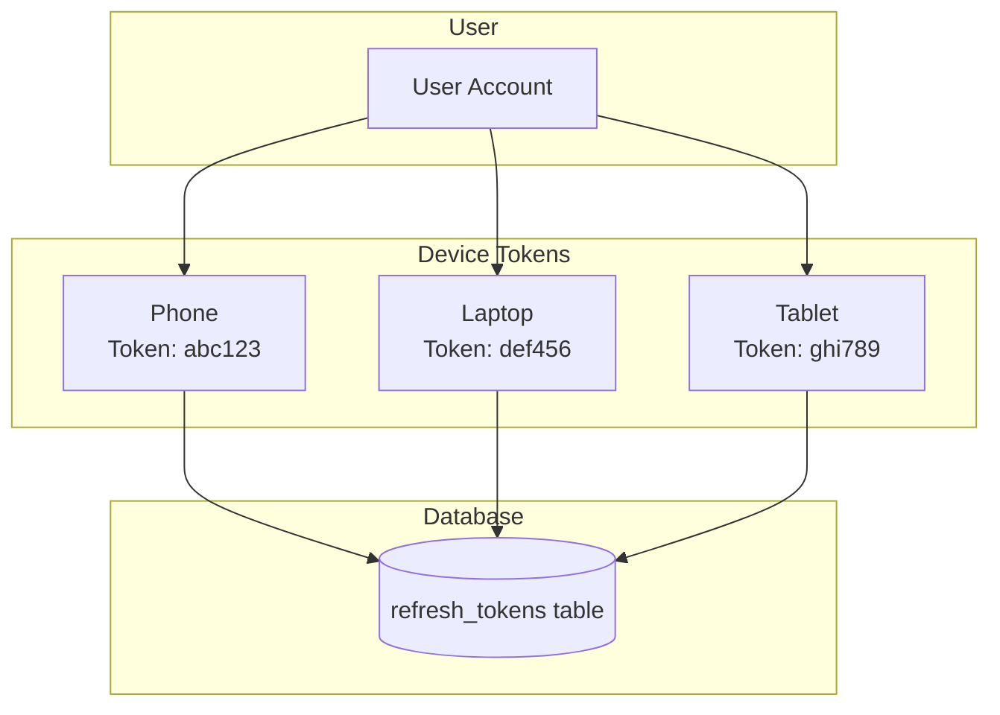
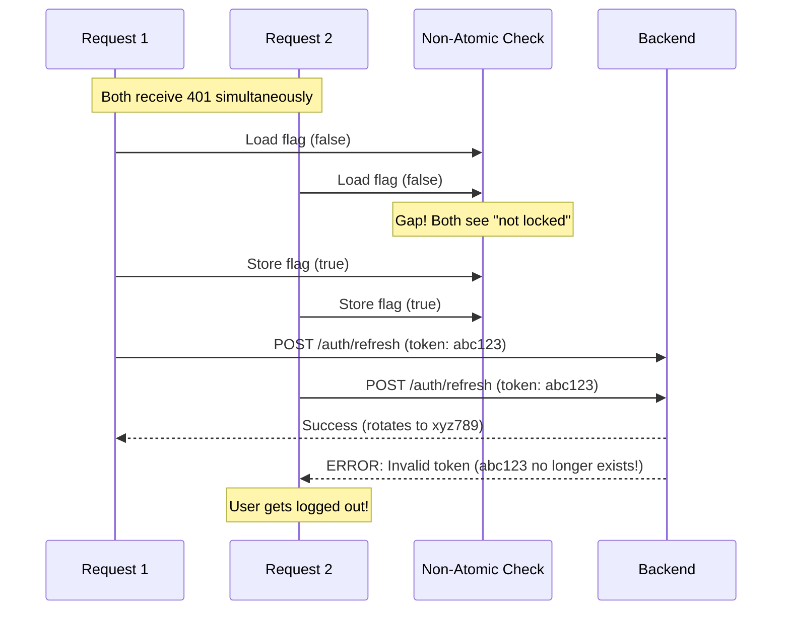
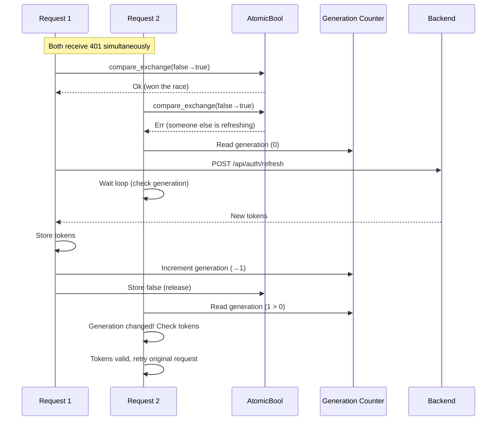

# Authentication Flow

## Registration Flow


## Login Flow


## Token Refresh Flow



## Multi-Device Support

Each device/browser session gets its own independent refresh token. This allows users to be logged in on multiple devices simultaneously without conflicts.



**Key behaviors:**

1. **Login creates new token** - Each login (on any device) creates a new refresh token record
2. **Refresh updates only that token** - Token rotation updates only the device's own token record
3. **Logout removes only that token** - Logging out on one device doesn't affect other devices
4. **Multiple tokens per user** - Database stores multiple refresh tokens per user (one per device)

**Database schema:**
```sql
refresh_tokens (
    id TEXT PRIMARY KEY,
    user_id TEXT NOT NULL,      -- Multiple tokens can have same user_id
    token_hash TEXT NOT NULL,
    expires_at DATETIME NOT NULL,
    created_at DATETIME NOT NULL
)
```

**Token refresh (per-device):**
```
Phone refreshes token "abc123":
  → Only token "abc123" is rotated to new value
  → Laptop token "def456" remains unchanged
  → Tablet token "ghi789" remains unchanged
```

## Logout Flow


## JWT Token Structure


## Authentication Middleware


## Security Measures


## Frontend Token Refresh Synchronization (Critical)

When the access token expires, multiple API requests may receive 401 errors simultaneously. **This is a critical mechanism** that prevents race conditions during token refresh which would otherwise cause users to be logged out unexpectedly.

### The Race Condition Problem

Without proper synchronization, the following can occur:



The problem is that `if (flag) { ... } flag = true` is not atomic - multiple requests can check the flag before any sets it.

### The Solution: Atomic Compare-Exchange

The frontend uses `AtomicBool::compare_exchange` for truly atomic check-and-set:



### Implementation Details

**Static atomics used:**

```rust
static REFRESH_IN_PROGRESS: AtomicBool = AtomicBool::new(false);
static REFRESH_GENERATION: AtomicU64 = AtomicU64::new(0);
```

**Why a generation counter?**

Simply checking if "any token exists" after waiting is insufficient - the old token might still be in localStorage during the refresh. The generation counter increments only after a successful refresh, allowing waiters to detect when new tokens are actually available.

**Key behaviors:**

1. **Atomic lock acquisition** - Uses `compare_exchange` to atomically check and set the lock
2. **Generation-based completion detection** - Waiters check if generation incremented, not just if tokens exist
3. **Timeout protection** - Waiters give up after 5 seconds to prevent infinite blocking
4. **Single refresh guarantee** - Exactly one token refresh request is made regardless of concurrent 401s

**Why this matters:**

- Without this, users can be randomly logged out when the access token expires and multiple requests are in flight
- The backend uses token rotation (old token is deleted when new one is created), so the race condition is particularly severe
- This is especially common on page load when multiple API calls happen simultaneously
