# Task Management Flow

## Task Completion Flow

## Task Review Flow

## Points Calculation Flow

## Reward Assignment Flow

## Missed Task Processing

## Task Status Calculation

## Task Detail Retrieval Flow

## Completion Rate Calculation

```mermaid
flowchart TB
    Start[Calculate Completion Rate] --> GetPeriod{Time Period?}

    GetPeriod -->|Week| WeekBounds[Get current week bounds]
    GetPeriod -->|Month| MonthBounds[Get current month bounds]
    GetPeriod -->|All Time| AllBounds[From task creation to now]

    WeekBounds & MonthBounds & AllBounds --> GetOccur[Count applicable occurrences<br/>based on recurrence pattern]

    GetOccur --> GetComp[Count completions where<br/>target was met]

    GetComp --> Calc[Rate = met / total × 100]

    Calc --> Result[Return rate + breakdown]
```

## Recurrence Logic

