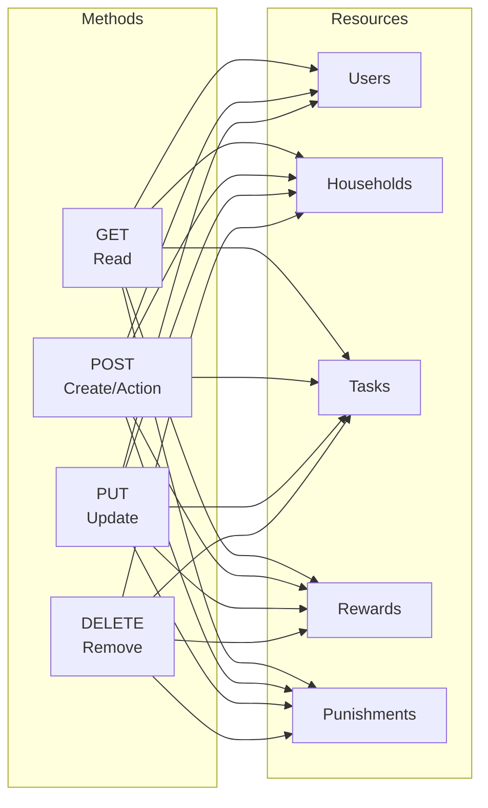
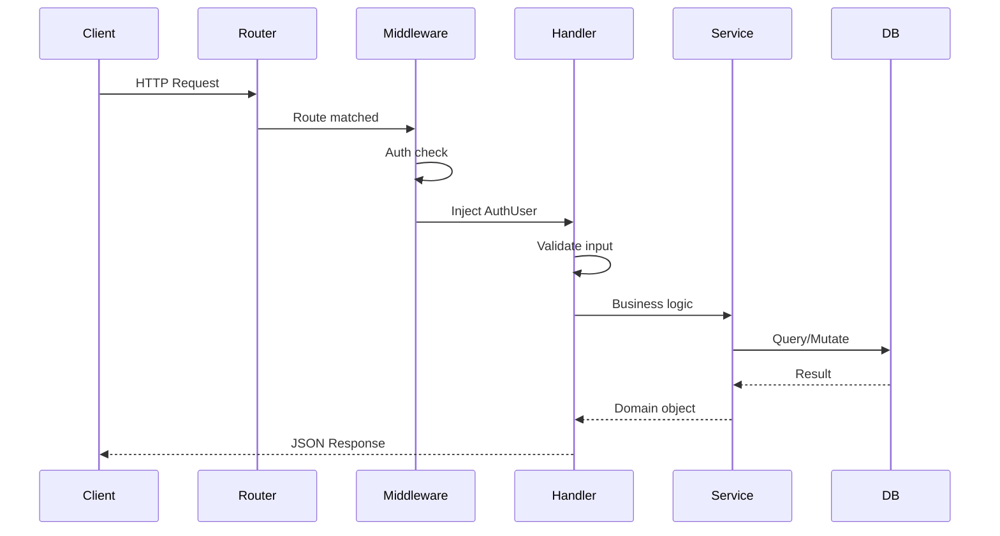
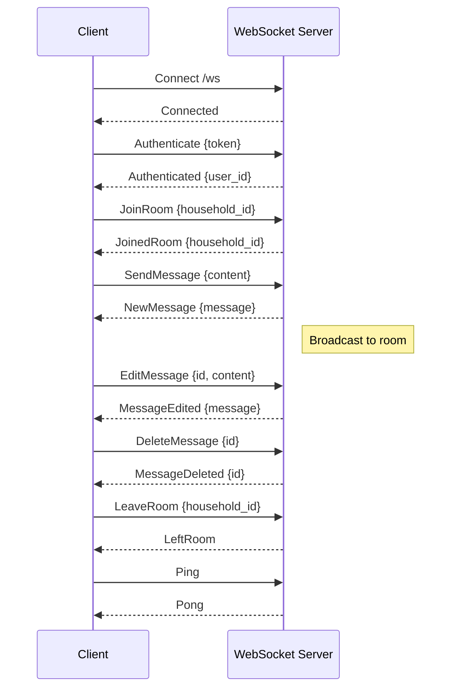
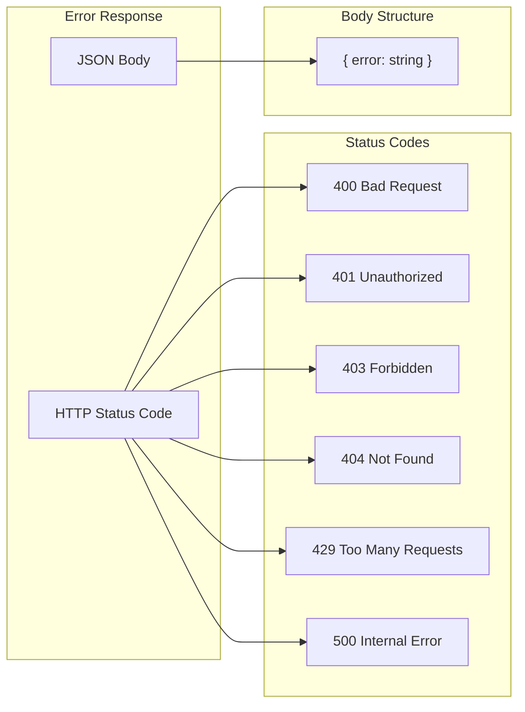
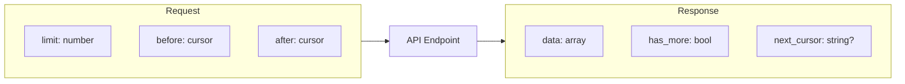

# API Structure

## API Endpoint Overview

```mermaid
flowchart TB
    subgraph "/api"
        subgraph "/auth"
            AR[POST /register]
            AL[POST /login]
            ALO[POST /logout]
            ARF[POST /refresh]
            AM[GET /me]
        end

        subgraph "/users"
            UG[GET /{id}]
            UP[PUT /{id}]
            USG[GET /me/settings]
            USP[PUT /me/settings]
        end

        subgraph "/households"
            HL[GET /]
            HC[POST /]
            HG[GET /{id}]
            HU[PUT /{id}]
            HD[DELETE /{id}]

            subgraph "/members"
                ML[GET /]
                MR[PUT /{user_id}/role]
                MP[POST /{user_id}/points]
                MD[DELETE /{user_id}]
            end

            subgraph "/settings"
                SG[GET /]
                SU[PUT /]
            end

            subgraph "/tasks"
                TL[GET /]
                TC[POST /]
                TG[GET /{task_id}]
                TU[PUT /{task_id}]
                TDD[DELETE /{task_id}]
                TS[GET /status]
                TD[GET /due]
                TA[GET /assigned]
                TP[GET /pending]
                TCO[POST /{task_id}/complete]
                TUC[DELETE /{task_id}/complete]
                TCA[POST /.../approve]
                TCR[POST /.../reject]
            end

            subgraph "/categories"
                CL[GET /]
                CC[POST /]
                CG[GET /{id}]
                CU[PUT /{id}]
                CDD[DELETE /{id}]
            end

            subgraph "/rewards"
                RL[GET /]
                RC[POST /]
                RG[GET /{id}]
                RU[PUT /{id}]
                RDD[DELETE /{id}]
                RP[POST /{id}/purchase]
                RAS[POST /{id}/assign]
                RUM[GET /users/me]
                RUA[GET /users]
                RPE[GET /pending]
            end

            subgraph "/punishments"
                PL[GET /]
                PC[POST /]
                PG[GET /{id}]
                PU[PUT /{id}]
                PDD[DELETE /{id}]
                PA[POST /{id}/assign]
                PCO[POST /{id}/complete]
                PUM[GET /users/me]
                PUA[GET /users]
                PPE[GET /pending]
                PO[GET /{id}/options]
                POA[POST /{id}/options/{option_id}]
                POD[DELETE /{id}/options/{option_id}]
                PPK[POST /user-punishments/{id}/pick]
            end

            subgraph "/invitations"
                IL[GET /]
                IC[POST /invite]
                IDD[DELETE /{id}]
            end

            subgraph "/chat"
                CHL[GET /]
                CHS[POST /]
                CHU[PUT /{id}]
                CHD[DELETE /{id}]
            end

            subgraph "/notes"
                NL[GET /]
                NC[POST /]
                NG[GET /{id}]
                NU[PUT /{id}]
                NDD[DELETE /{id}]
            end

            subgraph "/announcements"
                AL2[GET /]
                ALA[GET /active]
                AC[POST /]
                AG[GET /{id}]
                AU[PUT /{id}]
                ADD[DELETE /{id}]
            end

            subgraph "/activities"
                ACL[GET /]
            end

            subgraph "/leaderboard"
                LB[GET /]
            end

            subgraph "/point-conditions"
                PCL[GET /]
                PCC[POST /]
                PCG[GET /{id}]
                PCU[PUT /{id}]
                PCDD[DELETE /{id}]
            end
        end

        subgraph "/invitations"
            ILU[GET /]
            IA[POST /{id}/accept]
            IDC[POST /{id}/decline]
        end

        subgraph "/dashboard"
            DT[GET /tasks]
            DTD[GET /tasks/details]
            DTA[POST /tasks/{id}]
            DTR[DELETE /tasks/{id}]
            DTC[GET /tasks/{id}]
        end

        subgraph "/ws"
            WS[WebSocket /]
        end
    end
```

## HTTP Methods by Resource



## Role-Based Access

```mermaid
flowchart TB
    subgraph Endpoints
        Public[Public Endpoints<br/>/auth/register<br/>/auth/login]
        Auth[Authenticated<br/>/auth/me<br/>/users/*<br/>/invitations/*<br/>/dashboard/*]
        Member[Member+<br/>/households/{id}/*<br/>read operations]
        Admin[Admin+<br/>/households/{id}/*<br/>manage operations]
        Owner[Owner Only<br/>/households/{id}/settings<br/>/members/*/role<br/>delete household]
    end

    subgraph Roles
        Anon[Anonymous]
        User[Authenticated User]
        M[Member]
        A[Admin]
        O[Owner]
    end

    Anon --> Public
    User --> Auth
    M --> Member
    A --> Admin
    O --> Owner

    O -.->|inherits| A
    A -.->|inherits| M
    M -.->|inherits| User
```

## Request/Response Flow



## WebSocket Protocol



## Error Response Format



## Pagination Pattern


