# Gamification System Flow

## Points System Overview

```mermaid
flowchart TB
    subgraph "Points Sources"
        TaskComplete[Task Completed<br/>+points_reward]
        TaskMiss[Task Missed<br/>-points_penalty]
        Streak[Streak Bonus<br/>+streak points]
        Manual[Manual Adjustment<br/>±points]
        Purchase[Reward Purchase<br/>-point_cost]
    end

    subgraph "Points Storage"
        Membership[household_memberships.points]
    end

    TaskComplete & TaskMiss & Streak & Manual & Purchase --> Membership
```

## Reward Flow

## Punishment Flow

```mermaid
flowchart TB
    subgraph "Punishment Assignment"
        TaskMiss[Task Missed<br/>Auto-assign]
        AdminAssign[Admin Assignment<br/>Direct assign]
    end

    subgraph "User Punishment State"
        UP[user_punishments]
        Amount[amount: total assigned]
        Completed[completed_amount: done]
        Pending[pending_completion: awaiting approval]
    end

    subgraph "Completion"
        Complete[User completes]
        Check{requires_confirmation?}
        AutoApprove[Instant approval]
        PendingApproval[Wait for admin]
        Approve[Admin approves]
        Reject[Admin rejects]
    end

    TaskMiss & AdminAssign --> UP
    UP --> Amount & Completed & Pending

    Complete --> Check
    Check -->|No| AutoApprove
    Check -->|Yes| PendingApproval
    PendingApproval --> Approve
    PendingApproval --> Reject
```

## Random Choice Punishment Flow

## Habit Types

## Streak Calculation

## Point Conditions

## Leaderboard Calculation

## Complete Task Gamification Flow

