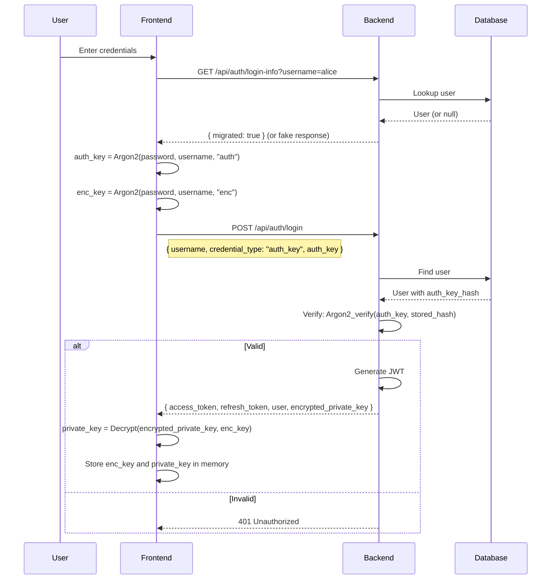
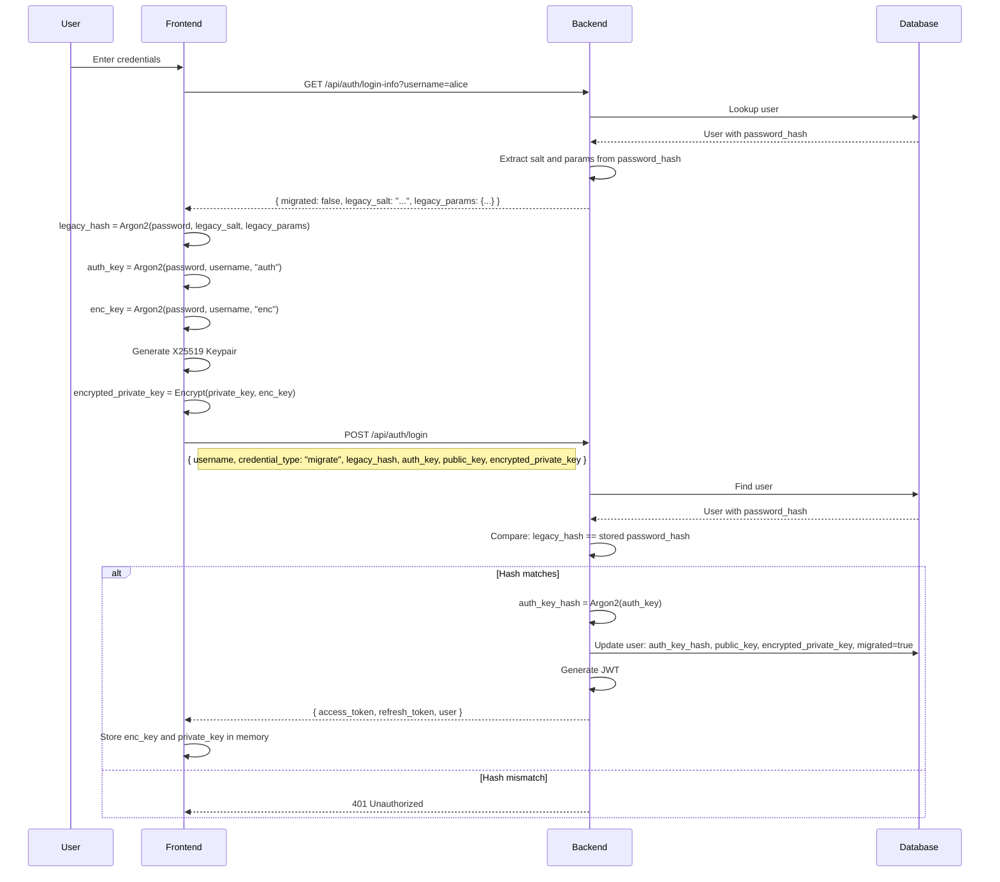
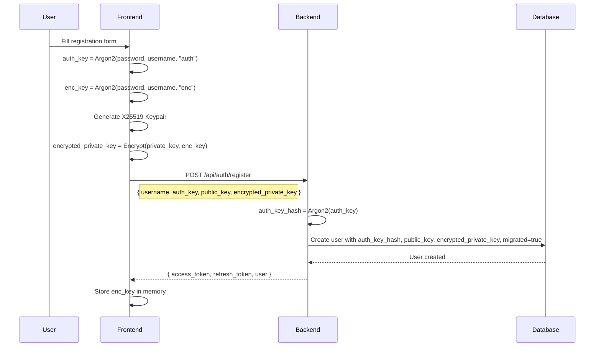
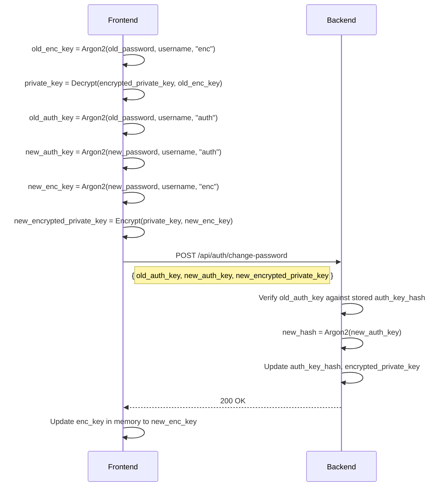
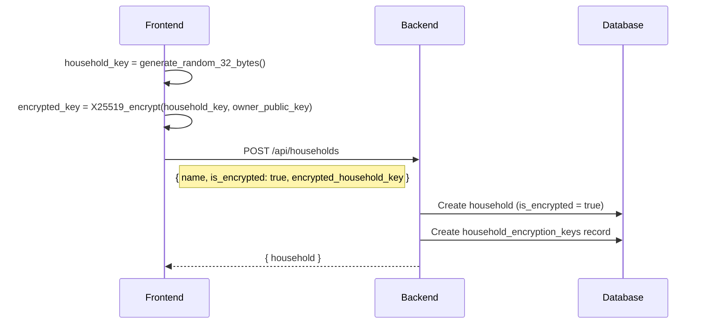
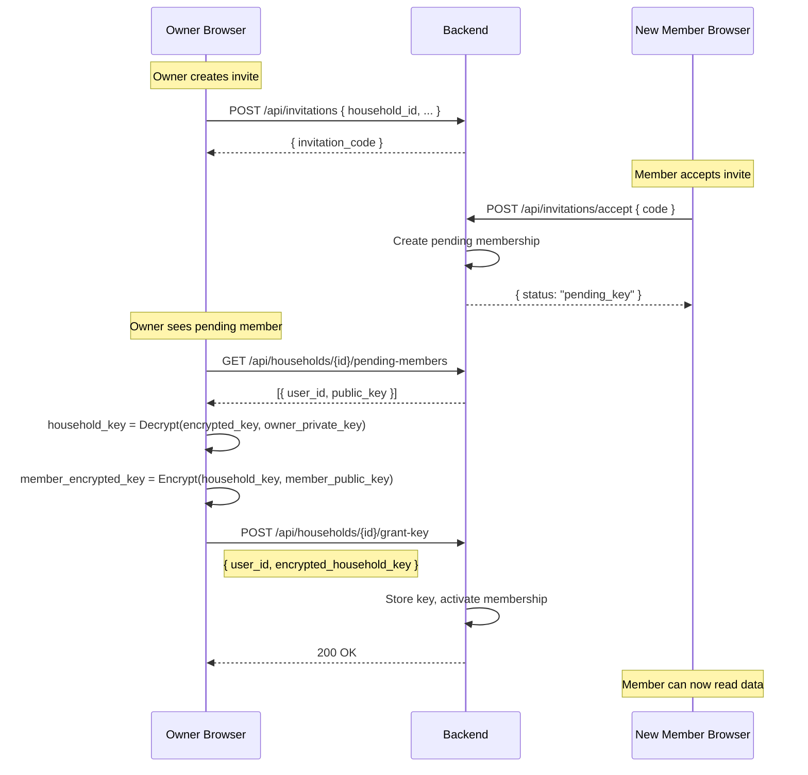
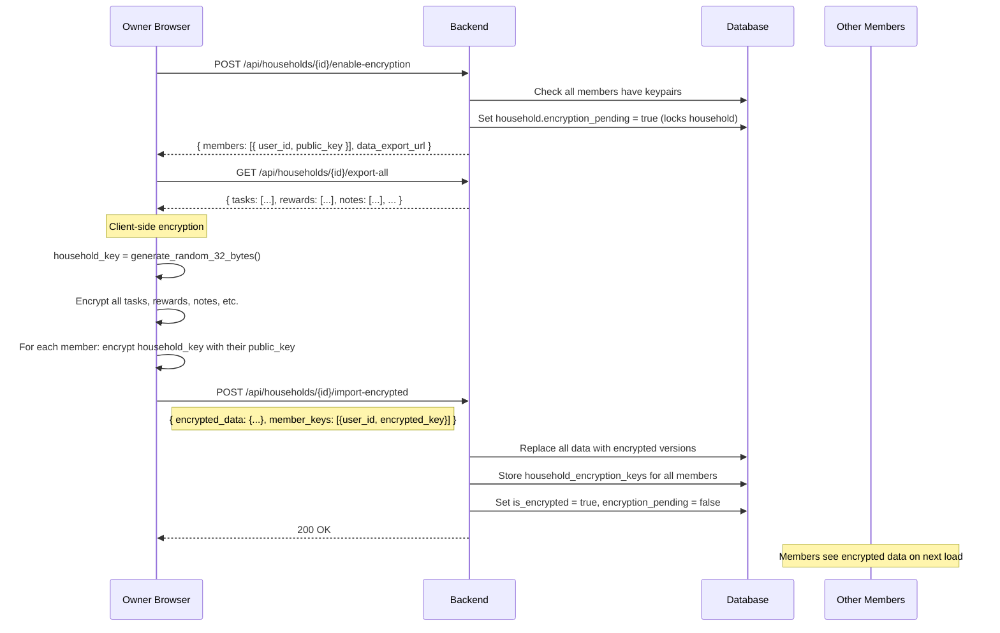

# End-to-End Encryption per Household (Draft)

> **Status:** Draft - Not implemented
> **Created:** 2026-02-19

## Overview

Optional end-to-end encryption for individual households. When encryption is enabled, the backend cannot read the data - only household members with the key can decrypt the contents.

### Design Decisions

| Aspect | Decision |
|--------|----------|
| **Scope** | Configurable per household (flag) |
| **Key Type** | Asymmetric (X25519) for key exchange, symmetric (ChaCha20-Poly1305) for data |
| **Key Distribution** | Owner encrypts household key with members' public keys |
| **Auth Change** | Client-side key derivation - backend never sees the password |
| **Salt for auth_key** | Username (no separate salt storage needed) |
| **Migration** | Client computes legacy_hash locally, backend never sees plaintext password |
| **User Enumeration Prevention** | Deterministic fake responses for non-existent users |

---

## Part 1: Client-Side Key Derivation (Prerequisite)

### Motivation

For true E2E encryption, the backend must never see the password. Therefore, the auth flow needs to be changed. The password is never transmitted in plaintext - not even during migration.

### Key Derivation

The username is used as salt for deriving keys. This eliminates the need for a separate salt endpoint.

```
┌─────────────────────────────────────────────────────────────┐
│  Client Key Derivation                                      │
├─────────────────────────────────────────────────────────────┤
│  auth_key = Argon2(password, username, context="auth")      │
│  encryption_key = Argon2(password, username, context="enc") │
│                                                             │
│  → auth_key is sent to backend (hashed again server-side)   │
│  → encryption_key stays local (for encrypting private key)  │
└─────────────────────────────────────────────────────────────┘

┌─────────────────────────────────────────────────────────────┐
│  Backend                                                    │
├─────────────────────────────────────────────────────────────┤
│  Stores: Hash(auth_key) with Argon2                         │
│  Verifies: Argon2_verify(auth_key, stored_hash)             │
│                                                             │
│  NEVER sees: password or encryption_key                     │
└─────────────────────────────────────────────────────────────┘
```

### Login Info Endpoint

Before login, the client fetches login information. This endpoint returns deterministic fake values for non-existent users to prevent user enumeration.

```
GET /api/auth/login-info?username=alice

User exists & migrated:
  {
    "migrated": true
  }

User exists & not migrated:
  {
    "migrated": false,
    "legacy_salt": "actual_salt_from_password_hash",
    "legacy_params": { "m": 19456, "t": 2, "p": 1 }
  }

User does NOT exist (deterministic fake values):
  {
    "migrated": Hash(username + SERVER_SECRET) % 2 == 0,
    "legacy_salt": Hash(username + SERVER_SECRET_2),
    "legacy_params": { "m": 19456, "t": 2, "p": 1 }
  }
```

An attacker cannot distinguish between real and fake responses. Any login attempt with wrong credentials returns the same 401 error.

### Sequence Diagram: Login (Migrated User)



### Sequence Diagram: Login with Migration (Non-Migrated User)



### Sequence Diagram: New Registration



### Security Properties

| Property | Guarantee |
|----------|-----------|
| Password never transmitted | Client only sends hashes (auth_key or legacy_hash) |
| No user enumeration | Fake deterministic responses for non-existent users |
| Backend cannot derive encryption_key | Only sees auth_key, not password |
| Replay protection | auth_key is hashed again server-side |

---

## Part 2: User Keypair Management

### US-E2E-001: User Keypair Generation

**As a** user
**I want to** automatically receive a keypair during registration
**so that** I can participate in encrypted households

#### Acceptance Criteria

- An X25519 keypair is generated during registration
- Private key is encrypted with the encryption_key (derived from password)
- Public key and encrypted private key are stored in the backend
- On login, the private key is decrypted and kept in memory
- Private key is cleared from memory on logout

#### Database Schema

```sql
ALTER TABLE users ADD COLUMN auth_key_hash TEXT;  -- New hash (replaces password_hash after migration)
ALTER TABLE users ADD COLUMN public_key TEXT;
ALTER TABLE users ADD COLUMN encrypted_private_key TEXT;
ALTER TABLE users ADD COLUMN key_migrated BOOLEAN DEFAULT FALSE;
-- Note: No separate salt column needed - username is used as salt
```

---

### US-E2E-002: Password Change with Key Re-Encryption

**As a** user
**I want to** be able to change my password
**so that** my account remains secure without losing access to encrypted households

#### Acceptance Criteria

- Old password is required to decrypt the private key
- Private key is re-encrypted with new encryption_key (from new password)
- auth_key_hash is updated with new auth_key
- Username remains as salt (no change needed)
- Household keys remain unchanged (encrypted with public key)

#### Sequence Diagram



---

## Part 3: Household Encryption

### US-E2E-003: Create Encrypted Household

**As an** owner
**I want to** enable encryption when creating a household
**so that** our household data remains private

#### Acceptance Criteria

- Checkbox "Enable end-to-end encryption" during household creation
- When enabled, a symmetric household key is generated
- Household key is encrypted with owner's public key and stored
- Flag `is_encrypted` is set on the household
- Encryption CANNOT be disabled after creation
- Warning: "If you lose your password, the data is irrecoverably lost"

#### Database Schema

```sql
ALTER TABLE households ADD COLUMN is_encrypted BOOLEAN DEFAULT FALSE;

CREATE TABLE household_encryption_keys (
    id TEXT PRIMARY KEY,
    household_id TEXT NOT NULL REFERENCES households(id) ON DELETE CASCADE,
    user_id TEXT NOT NULL REFERENCES users(id) ON DELETE CASCADE,
    encrypted_household_key TEXT NOT NULL,  -- Household key encrypted with user's public key
    created_at DATETIME NOT NULL DEFAULT CURRENT_TIMESTAMP,
    UNIQUE(household_id, user_id)
);
```

#### Sequence Diagram



---

### US-E2E-004: Invite Member to Encrypted Household

**As an** owner of an encrypted household
**I want to** invite new members
**so that** they can decrypt the household data

#### Acceptance Criteria

- On invite acceptance, owner fetches the new member's public key
- Owner decrypts household key with their own private key
- Owner encrypts household key with new member's public key
- New encrypted key is stored in the backend
- Process runs automatically on invite acceptance (owner must be online, or invite contains key)

#### Sequence Diagram: Invite Flow



#### Alternative: Key in Invite Link

For better UX, the encrypted key could be included directly in the invite link:

```
https://app.example/invite/ABC123#encrypted_key=...
```

- Advantage: Member can read immediately after acceptance
- Disadvantage: Owner must know member's public key beforehand (not possible for open invites)

---

### US-E2E-004b: Enable Encryption on Existing Household

**As an** owner
**I want to** enable encryption on an existing household
**so that** our existing data becomes protected

#### Acceptance Criteria

- Option "Enable encryption" in household settings (only for owner)
- All existing members must be migrated (have keypairs) before encryption can be enabled
- Warning: "This process may take a while and cannot be undone"
- All existing data is encrypted client-side and re-uploaded
- Household key is distributed to all existing members
- Process is atomic: either all data is encrypted or none (rollback on failure)
- Household is locked during encryption (read-only for other members)

#### Prerequisites

- All household members must have `key_migrated = true`
- Owner must be online for the entire process
- Sufficient client-side resources for bulk encryption

#### Sequence Diagram



#### Data Export Format

```json
{
  "tasks": [
    { "id": "...", "title": "plaintext", "description": "plaintext", ... }
  ],
  "rewards": [...],
  "punishments": [...],
  "chat_messages": [...],
  "notes": [...],
  "journal_entries": [...],
  "announcements": [...],
  "task_categories": [...]
}
```

#### Encrypted Import Format

```json
{
  "encrypted_data": {
    "tasks": [
      { "id": "...", "title": "Base64(encrypted)", "description": "Base64(encrypted)", ... }
    ],
    "rewards": [...],
    ...
  },
  "member_keys": [
    { "user_id": "owner-id", "encrypted_household_key": "Base64(...)" },
    { "user_id": "member1-id", "encrypted_household_key": "Base64(...)" },
    ...
  ]
}
```

#### Error Handling

| Error | Handling |
|-------|----------|
| Member without keypair | Block encryption, show which members need to login first |
| Network failure during upload | Rollback: keep original unencrypted data |
| Browser closed during process | On next login: detect `encryption_pending`, offer to retry or cancel |
| Timeout (large household) | Chunked upload with progress tracking |

#### UI Flow

1. Owner clicks "Enable Encryption" in settings
2. System checks prerequisites (all members migrated)
3. Warning dialog with confirmation
4. Progress bar: "Encrypting data... X/Y items"
5. Progress bar: "Uploading encrypted data..."
6. Success: "Encryption enabled. All data is now end-to-end encrypted."

---

### US-E2E-005: Store Data Encrypted

**As a** member of an encrypted household
**I want** my data to be stored encrypted
**so that** the backend cannot read it

#### Acceptance Criteria

- The following fields are encrypted:
  - Tasks: title, description
  - Rewards: name, description
  - Punishments: name, description
  - Chat Messages: content
  - Notes: title, content
  - Journal Entries: title, content
  - Announcements: title, content
  - Task Categories: name
- Encryption happens client-side before sending
- Decryption happens client-side after receiving
- Not encrypted (for server-side filtering): IDs, timestamps, is_shared, points, status flags

#### Encryption Format

```
encrypted_field = Base64(nonce || ciphertext || tag)
                = Base64(12 bytes || variable || 16 bytes)

Algorithm: ChaCha20-Poly1305
Key: household_key (32 bytes)
Nonce: Random 12 bytes per encryption
```

---

### US-E2E-006: Display Data Decrypted

**As a** member of an encrypted household
**I want** to see the data decrypted
**so that** I can use it normally

#### Acceptance Criteria

- Household key is fetched from backend and decrypted when switching households
- Decrypted household key is kept in memory (per household)
- All API responses are automatically decrypted
- Error message is displayed on decryption failure
- Performance: Decryption should be < 10ms per field

---

## Part 4: Migration of Existing Users

### US-E2E-007: Lazy Migration on Login

**As a** system
**I want to** automatically migrate existing users
**so that** they can use the new auth method without the backend ever seeing their plaintext password

#### Acceptance Criteria

- Backend never sees the plaintext password (not even during migration)
- Client computes legacy_hash using salt and params from login-info endpoint
- Client sends legacy_hash (not plaintext password) for verification
- Migration happens atomically in a single request
- After migration, only auth_key is accepted
- No user enumeration possible (fake deterministic responses for non-existent users)

#### Login Info Endpoint

```
GET /api/auth/login-info?username=alice

Response for existing migrated user:
{
  "migrated": true
}

Response for existing non-migrated user:
{
  "migrated": false,
  "legacy_salt": "extracted_from_password_hash",
  "legacy_params": {
    "m": 19456,
    "t": 2,
    "p": 1,
    "version": 19
  }
}

Response for non-existent user (deterministic fake):
{
  "migrated": deterministic_bool(username, SERVER_SECRET),
  "legacy_salt": deterministic_salt(username, SERVER_SECRET),
  "legacy_params": { "m": 19456, "t": 2, "p": 1, "version": 19 }
}
```

#### Backend Implementation: Fake Response Generation

```rust
fn generate_fake_login_info(username: &str, server_secret: &str) -> LoginInfo {
    let hash_input = format!("{}{}", username, server_secret);
    let hash = sha256(hash_input.as_bytes());

    LoginInfo {
        // Deterministic boolean based on first byte
        migrated: hash[0] % 2 == 0,
        // Deterministic salt based on hash (base64 encoded)
        legacy_salt: Some(base64_encode(&hash[0..16])),
        // Standard params
        legacy_params: Some(Argon2Params::default()),
    }
}
```

#### Login Endpoint Logic

```
POST /api/auth/login
{
  "username": "alice",
  "credential_type": "auth_key" | "migrate",

  // For credential_type: "auth_key" (migrated users)
  "auth_key": "...",

  // For credential_type: "migrate" (non-migrated users)
  "legacy_hash": "...",           // Argon2(password, legacy_salt, legacy_params)
  "auth_key": "...",              // Argon2(password, username, "auth")
  "public_key": "...",            // X25519 public key
  "encrypted_private_key": "..."  // Private key encrypted with enc_key
}

Backend Logic:
  user = find_user(username)

  if user is None:
    return 401 Unauthorized  // Same response for all failures

  if credential_type == "auth_key":
    if not user.key_migrated:
      return 401 Unauthorized
    if not verify(auth_key, user.auth_key_hash):
      return 401 Unauthorized
    return JWT + user data

  if credential_type == "migrate":
    if user.key_migrated:
      return 401 Unauthorized  // Should use auth_key
    if legacy_hash != user.password_hash:
      return 401 Unauthorized

    // Migration!
    user.auth_key_hash = Argon2(auth_key)
    user.public_key = public_key
    user.encrypted_private_key = encrypted_private_key
    user.key_migrated = true
    user.password_hash = null  // Clear old password hash
    save(user)

    return JWT + user data
```

#### Client Login Flow

```
async function login(username, password) {
  // Step 1: Get login info
  const info = await fetch(`/api/auth/login-info?username=${username}`);

  // Step 2: Derive keys
  const auth_key = argon2(password, username, "auth");
  const enc_key = argon2(password, username, "enc");

  if (info.migrated) {
    // Step 3a: Migrated user - send auth_key only
    return await fetch('/api/auth/login', {
      method: 'POST',
      body: JSON.stringify({
        username,
        credential_type: 'auth_key',
        auth_key
      })
    });
  } else {
    // Step 3b: Non-migrated user - compute legacy_hash and migrate
    const legacy_hash = argon2(password, info.legacy_salt, info.legacy_params);
    const keypair = generateX25519Keypair();
    const encrypted_private_key = encrypt(keypair.privateKey, enc_key);

    return await fetch('/api/auth/login', {
      method: 'POST',
      body: JSON.stringify({
        username,
        credential_type: 'migrate',
        legacy_hash,
        auth_key,
        public_key: keypair.publicKey,
        encrypted_private_key
      })
    });
  }
}
```

#### Security Analysis

| Attack | Mitigation |
|--------|------------|
| User enumeration via login-info | Deterministic fake responses for non-existent users |
| Timing attack on login-info | Constant-time comparison, same response time |
| Password transmitted in plaintext | Never - only hashes (legacy_hash or auth_key) are sent |
| Replay attack with legacy_hash | legacy_hash is only valid once (migration clears password_hash) |
| Offline brute-force of legacy_hash | Same difficulty as attacking the original password_hash |

---

## Part 5: Edge Cases & Limitations

### Known Limitations

| Limitation | Reason | Workaround |
|------------|--------|------------|
| No server-side search | Data is encrypted | Client-side filtering |
| Owner must be online for key grant | Key exchange requires owner | Invite link with key (if public key known) |
| Password reset = data loss | No key escrow | Backup codes? Recovery keys? |
| No household key rotation | Too much effort | On member removal: create new household |

### Password Forgotten Scenario

For encrypted households:
- User loses password → loses private key → loses access to household keys
- Data is irrecoverably lost (for this user)
- Other members retain access

Possible solution (out of scope for V1):
- Recovery keys (like Bitwarden)
- Trusted contact recovery

### Member Removal

- Removed member theoretically still has the household key in memory/cache
- True protection would require key rotation
- V1: Accept as known limitation
- Warning in UI: "Removed members may still have access to previous data"

---

## Part 6: Technical Architecture

### Crates (Backend & shared)

```toml
# shared/Cargo.toml
chacha20poly1305 = "0.10"  # Symmetric encryption
x25519-dalek = "2"         # Key exchange
argon2 = "0.5"             # Key derivation (already present)
base64 = "0.21"            # Encoding
zeroize = "1"              # Secure memory cleanup
```

### Crates (Frontend/WASM)

```toml
# frontend/Cargo.toml
argon2 = "0.5"             # Client-side key derivation
chacha20poly1305 = "0.10"
x25519-dalek = "2"
getrandom = { version = "0.2", features = ["js"] }  # WASM random
```

### Shared Types

```rust
// shared/src/crypto.rs

/// Encrypted string (Base64-encoded nonce || ciphertext || tag)
#[derive(Clone, Serialize, Deserialize)]
pub struct EncryptedString(pub String);

/// Request for encrypted households
#[derive(Serialize, Deserialize)]
pub struct CreateEncryptedHouseholdRequest {
    pub name: String,
    pub is_encrypted: bool,
    pub encrypted_household_key: Option<String>,  // Only if is_encrypted
}

/// Encrypted task
#[derive(Serialize, Deserialize)]
pub struct EncryptedTask {
    pub id: String,
    pub household_id: String,
    pub title: EncryptedString,        // Encrypted
    pub description: Option<EncryptedString>,  // Encrypted
    pub points: i32,                   // Not encrypted
    pub created_at: DateTime<Utc>,     // Not encrypted
    // ... other fields
}
```

### Frontend Crypto Service

```rust
// frontend/src/crypto.rs

pub struct CryptoService {
    username: Option<String>,
    encryption_key: Option<[u8; 32]>,  // Derived from password + username
    private_key: Option<x25519_dalek::StaticSecret>,
    household_keys: HashMap<String, [u8; 32]>,  // household_id -> key
}

impl CryptoService {
    /// Derive auth_key and encryption_key from password using username as salt
    pub fn derive_keys(password: &str, username: &str) -> (AuthKey, EncryptionKey) {
        let auth_key = argon2(password, username, b"auth");
        let enc_key = argon2(password, username, b"enc");
        (auth_key, enc_key)
    }

    /// Derive legacy_hash for migration using the old salt and params
    pub fn derive_legacy_hash(
        password: &str,
        legacy_salt: &str,
        legacy_params: &Argon2Params
    ) -> LegacyHash {
        argon2_with_params(password, legacy_salt, legacy_params)
    }

    /// Generate a new X25519 keypair
    pub fn generate_keypair() -> (PublicKey, StaticSecret);

    /// Encrypt private key with encryption_key for storage
    pub fn encrypt_private_key(private_key: &StaticSecret, enc_key: &[u8; 32]) -> String;

    /// Decrypt private key after login
    pub fn decrypt_private_key(&mut self, encrypted: &str, enc_key: &[u8; 32]);

    /// Decrypt household key using private key (X25519)
    pub fn decrypt_household_key(&mut self, household_id: &str, encrypted: &str);

    /// Encrypt data with household key (ChaCha20-Poly1305)
    pub fn encrypt(&self, household_id: &str, plaintext: &str) -> EncryptedString;

    /// Decrypt data with household key (ChaCha20-Poly1305)
    pub fn decrypt(&self, household_id: &str, encrypted: &EncryptedString) -> String;

    /// Clear all keys from memory (on logout)
    pub fn clear(&mut self);
}
```

---

## Out of Scope (for later)

- Key rotation on member removal
- Recovery keys / backup codes
- Hardware key support (WebAuthn)
- Encryption of file attachments (if added)
- Audit log for key access
- Offline encryption (interaction with offline support)
